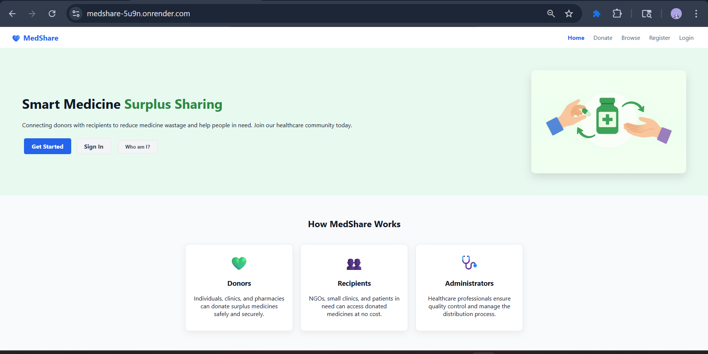
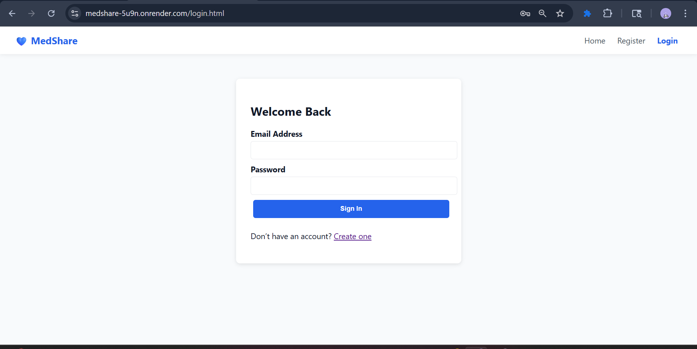
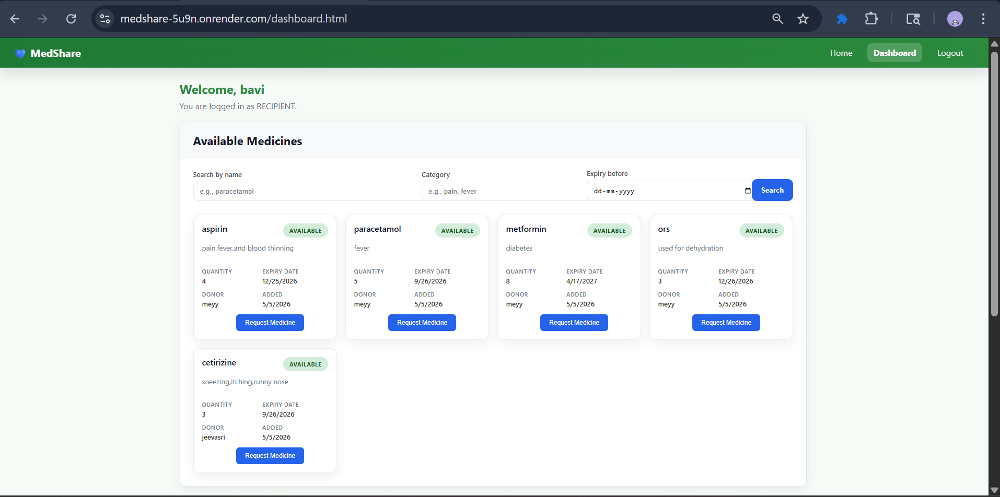
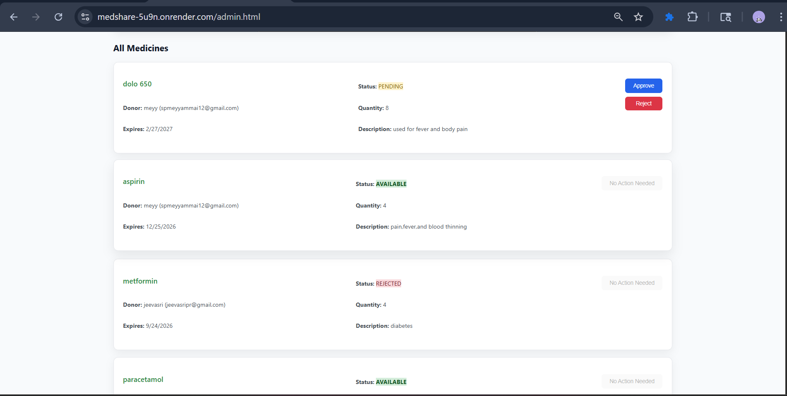
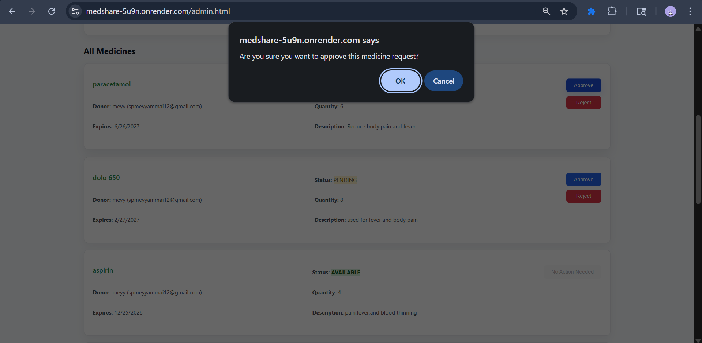
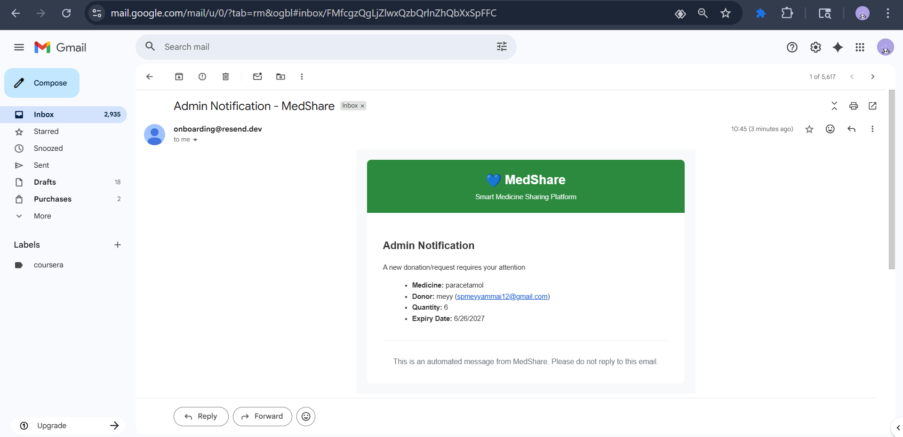
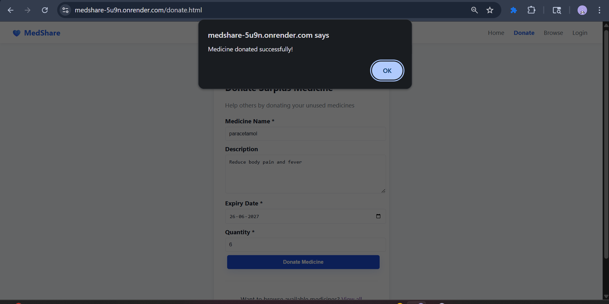

# 🏥 MedShare - Smart Medicine Surplus Sharing System

A web-based platform connecting medicine donors with recipients to reduce waste and help those in need.


## Live Demo
🔗 https://medshare-5u9n.onrender.com
## ✨ Features

### ✅ Completed Modules
- **User Authentication System** - JWT-based auth with role-based access
- **Medicine Donation System** - Donors can list surplus medicines
- **Medicine Request System** - Recipients can browse and request medicines
- **Admin Dashboard** - Monitor donations, approve requests, manage users

### 🔐 User Roles
- **DONOR** - Can add medicines for donation
- **RECIPIENT** - Can browse and request available medicines
- **ADMIN** - Can approve/reject requests and view all data

## 🚀 Quick Start

### Backend Setup
```bash
cd backend
npm install
npm run start
```
Server runs on `http://localhost:5000`

### Frontend Setup
```bash
# Option 1: Python HTTP Server
python -m http.server 5500

# Option 2: Node.js HTTP Server
npx http-server -p 5500

# Option 3: VS Code Live Server Extension
# Right-click index.html → "Open with Live Server"
```
Frontend runs on `http://127.0.0.1:5500`

## Serve frontend from backend (single command)

The backend now also serves the frontend statically. By default it looks for a `medshare-frontend/` folder in the project root. If not present, it serves files from the project root (where `index.html` is).

1) Ensure your `.env` in `backend/` is configured (MONGO_URI, JWT_SECRET, CLIENT_ORIGIN, PORT)
2) Start the backend and open the app directly:

```bash
node backend/src/server.js
# then open http://localhost:5000/
```

Notes:
- Existing API routes remain under `/api/auth`, `/api/medicines`, and `/api/admin`.
- CORS allows both `CLIENT_ORIGIN` and same-origin `http://localhost:5000` so the frontend can call APIs.

## 🧪 Testing the System

### 1. Automated Backend Tests
```bash
cd backend
npm run test:auth      # Test authentication only
npm run test:complete  # Test complete system
```

### 2. Manual Testing Flow

#### Step 1: Register Users
1. Open `http://127.0.0.1:5500/register.html`
2. Create accounts with different roles:
   - **Donor**: `donor@test.com` (DONOR role)
   - **Recipient**: `recipient@test.com` (RECIPIENT role)
   - **Admin**: `admin@test.com` (ADMIN role)

#### Step 2: Test Medicine Donation
1. Login as **Donor** → `http://127.0.0.1:5500/login.html`
2. Go to **Donate** page → `http://127.0.0.1:5500/donate.html`
3. Fill form: Medicine name, description, expiry date, quantity
4. Submit → Medicine added to system

#### Step 3: Test Medicine Request
1. Login as **Recipient**
2. Go to **Browse** page → `http://127.0.0.1:5500/medicines.html`
3. View available medicines
4. Click "Request Medicine" → Request submitted

#### Step 4: Test Admin Dashboard
1. Login as **Admin**
2. Go to **Admin** page → `http://127.0.0.1:5500/admin.html`
3. View all medicines and users
4. Approve/reject medicine requests

## 📁 Project Structure

```
medshare/
├── backend/
│   ├── src/
│   │   ├── config/db.js          # MongoDB connection
│   │   ├── models/
│   │   │   ├── User.js           # User schema
│   │   │   └── Medicine.js       # Medicine schema
│   │   ├── middleware/auth.js     # JWT authentication
│   │   ├── routes/
│   │   │   ├── authRoutes.js     # User auth endpoints
│   │   │   ├── medicineRoutes.js # Medicine endpoints
│   │   │   └── adminRoutes.js    # Admin endpoints
│   │   └── server.js             # Express server
│   └── scripts/
│       ├── testAuth.mjs          # Auth testing
│       └── testComplete.mjs      # Full system testing
├── css/
│   ├── styles.css                # Main styles
│   └── js/
│       ├── auth.js               # Authentication logic
│       ├── medicine.js           # Medicine operations
│       └── admin.js              # Admin dashboard
├── index.html                    # Homepage
├── register.html                 # User registration
├── login.html                    # User login
├── donate.html                   # Medicine donation
├── medicines.html                # Browse medicines
└── admin.html                    # Admin dashboard
```

## 🔧 API Endpoints

### Authentication
- `POST /api/auth/register` - User registration
- `POST /api/auth/login` - User login
- `GET /api/auth/me` - Get current user

### Medicines
- `POST /api/medicines/add` - Add medicine (DONOR only)
- `GET /api/medicines` - List available medicines
- `POST /api/medicines/request/:id` - Request medicine (RECIPIENT only)

### Admin
- `GET /api/admin/medicines` - View all medicines
- `GET /api/admin/users` - View all users
- `PUT /api/admin/approve/:id` - Approve/reject requests


## Screenshots

## Screenshots

### Home Page


### Login Page


### Recipient Dashboard


### Admin Dashboard


### Admin Approve Page


### Admin Notification Page


### User Donate Page


Next step

The system is now fully functional with:
- ✅ User authentication and role management
- ✅ Medicine donation and request workflow
- ✅ Admin dashboard and approval system
- ✅ Frontend forms and navigation
- ✅ Complete API testing

Ready for production deployment or additional features like:
- Medicine expiry notifications
- Email confirmations
- Advanced search and filtering
- Mobile app development

## 🐛 Troubleshooting

- **Backend won't start?** Check MongoDB connection
- **CORS errors?** Verify backend (5000) and frontend (5500) ports
- **Auth fails?** Check JWT_SECRET in environment
- **Database issues?** Ensure MongoDB is running locally

## 📝 License

This project is for educational and humanitarian purposes.
